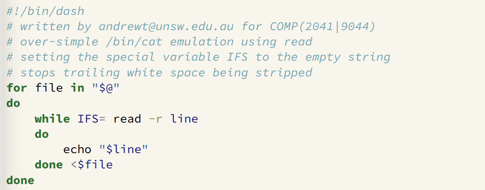
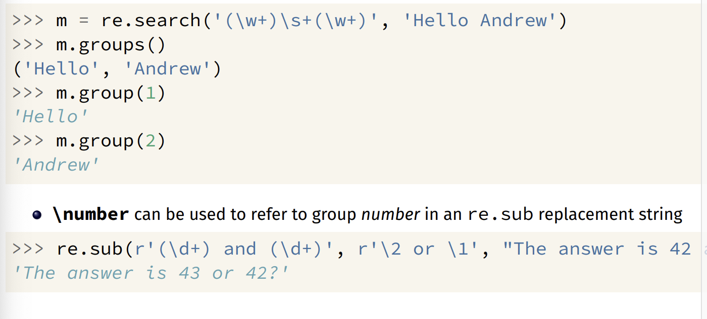
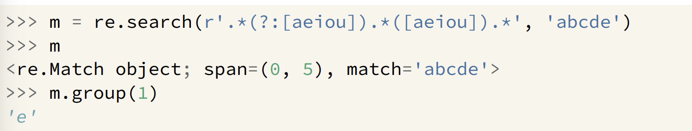
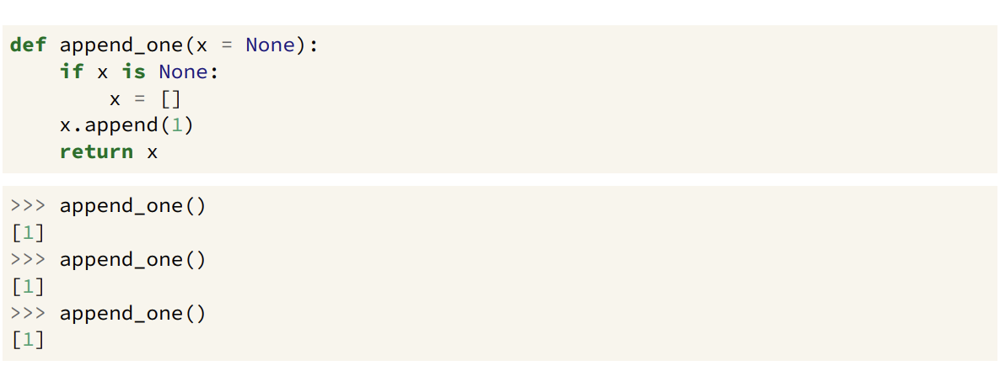
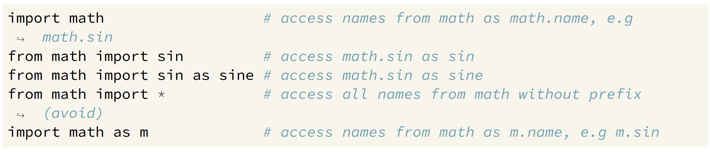
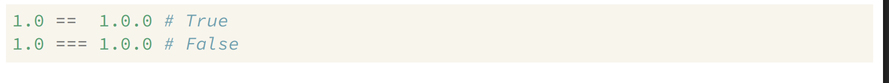

# Filters

- A filter is a program that transforms a byte stream
- Read bytes from standard input 
- Perform useful transformations
- Write the transformed bytes to their standard input

## Cat - the simplest filter

- ```cat``` command copies its input to output unchanged
- ```cat``` - given filenames, concatenates them to stdout
- ```cat``` - given no filenames, copies stdin to stdout unchanged

#### Options:
- ```-n```: number of output lines (starting from 1)
- ```-A```: display non-printing characters - handy for debugging
- ```-s```: squeeze consecutive blank lines onto a single blank line
- ```tac``` command - reverses order of lines
- ```rev``` command - reverses the order of characters in lines

## Regular Expressions

| Symbol | Meaning |
| :------: | ------- |
| \w | any word character
| \d | any digit 
| * | zero or more repetitions |
| + | one or more repetitions
| ```pattern1``` \| ```pattern2``` | union of elements
| (..) | Grouping elements
| \ | Removes any special meaning of the following character
| [ABC] | A or B or C
| [^ABC] | Not (A or B or C)
| ^ | Anchor at the start of the line
| $ | Anchor at the end of a line
| . | Matches any single character
| ? | zero or one occurence
| {3} | Exactly 3 occurences
| {3, } | 3 or more occurences
| {, 3} | 3 or less occurences
| {3, 5} | 3 to 5 occurences

- When using regex expressions use ' ' so shell doesn't intepret any symbols

## Grep

#### Commands:
- ```-E``` use extended regular expression syntax
- ```-i``` ignore upper/lower-case difference in matching
- ```-v``` only display lines that do not match the pattern
- ```-c``` print a count of matching lines
- ```-w``` only match pattern if it makes a complete word
- ```-x``` only match pattern if it makes a complete line
- ```-F``` match strings only (no regular expressions)
- ```-G``` matches a subset of regular expressions
- ```-P``` POSIX regular expressions + Perl extensions

## wc: word counter
- **wc** summarises its input as a single line
Useful **wc** options:
- ```-c``` print the number of characters
- ```-w``` print the number of words (non-white space) only
- ```-l``` print the number of lines only

## tr: transliterate Characters
- ```tr``` reads characters and writes characters, mapping (replacing) some chars with others
- The mapping is specified as ```tr sourceChar destChar```.
- For example ```tr 'abc' '123'```.
- ```sourceChar = 'abc' destChar = '123' a->1 b->2 c->3```.

Useful **tr** options:
- ```-c```: map all bytes not occuring in ```sourceChars```.
- ```-s```: squeeze adjacent repeated characters out. 
- ```-d```: delete all characters in ```sourceChars```.


## head/tail: select first/last lines
- ```head``` prints the first ```n``` (default 10) lines of input.
- ```tail``` prints the last ```n``` lines of input
- ```-n``` option changes number of lines head/tail prints.
  - e.g ```tail -n file``` prints last 30 lines of file
- Combine ```head``` and ```tail``` to select a range of lines
  - ```head -n 100 | tail -n 20``` copies lines 81..100 to output


## cut: vertical slice
The ```cut``` command prints selected parts of input lines
- ```cut``` can select fields, column seperator defaults to tab
- ```cut``` can select a range of character positions

Useful Options:
- ```-f```: print only the specified fields (tab-seperated) on output.
- ```-c```: print only chars in the specified positions.
- ```-d```: use character ```c``` as the field seperator.


## sort: sort lines
- The ```sort``` command copies input to output but ensures that the output is arranged in some particular order of lines.
- Understands that text data sometimes occurs in delimited fields
- Can distinguish numbers and sort appropriately
- Can ignore punctuation or case indifferences
- Can sort files "in-place" as well as behaving like a filter.
#### Options:
- ```-r```: sort in descending order (reverse sort)
- ```-n```: sort numerically rather than lexicographically
- ```-d```: dictionary order: ignore non-letters and non-digits
- ```-tc```: use character c to seperate columns (default: non-blank)
- ```-kn```: sort on column n

Hint: to specify ```Tab``` as a field delimiter, type CTRL-v before pressing Tab key.

## uniq: remove or count duplicates
- ```uniq``` removes all but one copy of adjacent identical lines
- often preceded by ```cut```
- almost always preced by ```sort```

#### Options:
- ```-c```: also print number of times each line is duplicated
- ```-d```: only print (one copy of) duplicated lines
- ```-u```: only print lines that occur uniquely (only once)

## sed: stream editor
- ```sed``` is an editor for streams (pipelines)
- ```sed``` can also be used to change files
- ```sed``` is not interactive - editing commands specified on command line or in a file

#### Options:
- ```-n```: do not print lines by default - applies all editing commands as normal but displays no ouput, unless p appended to edit command.
- ```-E```: extended regular expressions 

#### Editing commands:
- ```p``` : print the current line
- ```d``` : delete (don't print) the current line
- ```s/regex/replace/``` : substitute first occurence of string matching regex by replace string
- ```s/regex/replace/g``` : substitute all occurences of string matching regex by replace string
- ```q``` : terminate execution of sed
- ```line_number``` : selects the specified line
- ```start_line_number, end_line_number``` : selects all lines between specified line numbers
- ```/regex/``` : selects all lines that match regex
- ```/regex1/,/regex2/``` : selects all lines between lines matching regex1 and regex2


## find: search for files
- The ```find``` command allows you to search for files based on specific properties
- Searches entire directory trees, testing each file for the required property
- Takes action for all matching files.


## join: database operator
- ```join``` merges two files using the values in a field in each file as a common key

#### Options:
- ```1k``` : key field in first file is k
- ```2k``` : key field in second file is k
- ```aN``` : print a line for each unpairable line in file N (1 or 2)
- ```i``` : ignore case
- ```tc``` : tab character is c


## paste: combine files


## tee: send copy of pipeline to file


## xargs: run commands with arguments from standard input

Some useful **xargs** options:
- ```-n```: use at most max-args arguments per command line
- ```-P```: run up to max-procs processes at a time
- ```-i```: replace occurences of replace-str with words read from stdin.

 

# Shells
- Shells are command intepreters
  - they allow interactivee users to execute commands
  - typically a command causes another program to run
  - shells may have a graphical interface

- command-line shells are programmable, powerful tools for expert users
- ```bash``` is the most popular used shell for unix-like systems 
  - other shells include ```dash, ash, zsh, fish```

## What Shells Do
- Unix shells have the same basic mode of operation:
```
loop
  if (interactive) print a prompt
  read a line of user input
  apply transformations to line
  split line into words using whitespace
  use first word in line as command name
  execute command, passing other words as arguments
end loop
```
- shells can also be run with commands in a file
- shells are programming languages

## Processing a Shell Input Line
- A series of transformations are applied to Shell input lines

1. tilde expansion , e.g ~z1234567 → /home/z1234567
2. parameter and variable expansions e.g. $HOME → /home/z1234567
3. arithmetic expansion, e.g. $((6 * 7)) → 42
4. command substitution, e.g. $(whoami) → z1234567
5. word splitting - line is broken up on white-space
6. filename expansion (globbing), e.g. *.c → main.c i.c
7. I/O redirection e.g. <i.txt → stdin replaced with stream from i.txt
8. first word used as program name, other words passed as arguments

## echo : print arguments to stdout
- ```echo``` prints its arguments to stdout
- ```echo``` is often built into shells for efficiency, but also provided by ```/bin/echo```
- Two useful ```echo``` options:
  - ```-n``` do not output a trailing newline
  - ```-e``` enable interpretation of backlash escapes 

## Shell Variables
- shell variables are untyped - consider them as strings
  - note that **1** is equivalent to **"1"**
- shell variables are not declared
- shell variables do not need initalisation
  - initial value is empty string
- one scope - no local variables
- ```$name``` replaced with value of variable ```name```
- ```name=value``` assigns ```value``` to variable ```name``` (no spaces around =)

## $(command) - command expansion:
- ```$(command)``` is evaluated by running ```command```.
- stdout is captured from ```commmand```
- ```$(command)``` is replaced with the entire captured stdout
- ```command``` (backticks) is equivalent to ```$command```

## ' ' - Single Quotes
- single quotes ' ' group the characters within into a single word
  - no characters interpreted specially inside single quotes
  - variables, commands and arithmetic are not expanded inside single quotes
  - globbing and word-splitting does not occur inside double quotes
  - a single quote can not occur within single quotes
  - you can put a double quote between single-quotes


## " " - Double Quotes
- double quotes "" group the characters within into a single word
  - variables, commands and arithmetic are expanded inside double quotes
  - backslash can be used to escape $ “ “” ’’ \
  - other characters not interpreted specially inside double quotes
  - globbing and word-splitting does not occur inside double quotes
  - you can put a single quote between double-quotes


## << - here documents
- <<```word``` called a here document
- following lines until ```word``` specify multi-line string as command input
- variables and commands expanded - same as double quotes
- <<```'word'``` variables and commands not expanded - same as single quotes
- <<```-word``` removes leading tabs from each line, allowing indentation within scripts


## word splitting


## *?[]! - pathname globbing
- ***?[]!** characters cause a word to be matched against pathnames
- \* matches 0 or more of any character - equivalent to regex \*
- ? matches any one character - equivalent to regex
- **[characters]** matches 1 of characters - same as regex []
- **[!characters]** matches 1 character not in characters - same as regex [^] 
- if no pathname matches the word is unchanged


## I/O Redirection
- stdin, stdout & stderr for a command can be directed to/from files

--------
< *infile* connect ```stdin``` to the file ```infile```<br>
\> *outfile* send ```stdout``` to the file ```outfile``` <br>
\>> *outfile* append ```stdout``` to the file ```outfile``` <br>
2> *outfile* send ```stderr``` to the file ```outfile``` <br>
2>> *outfile* append ```stderr``` to the file ```outfile``` <br>
\> outfile 2 > &1 send ```stderr+stdout``` to ```outfile``` <br>
1>&2 send ```stdout``` to ```stderr``` (handy for error messages) <br>
\<< word here-document <br>
<< <'string' (in bash) here string
&> outfile (in bash) send ```stdout+stderr``` to ```outfile```
______


- beware: > truncates file before executing command
- always have back ups!

## Pipelines
- **command<sub>1</sub>** | **command<sub>2</sub>** | **command<sub>3</sub>** | ...
- stdout of **command<sub>n-1</sub>** connected to stdin of **command<sub>n</sub>**
- beware changes to variables in pipelines are lost

## searching PATH for the program

- first word on line specifies command to be run
- if first word is not the full pathname of a file the clon-sperated list of directory specified by the variable PATH is searched
- for example ```PATH=/bin/:usr/bin/bin:/home/z1234567/bin``` and the command ```kitten``` the shell will check these files in order:
  - ```/bin/kitten/usr/bin/kitten/home/z1234567/bin```
  - the first that exists and is executable will be run
  - if none exist the shell will print an error message
- or ```.``` in PATH causes the current directory to be checked
- this can be convenient - but majke it last not first,
- for example ```PATH=/bin/:usr/bin/:/home/z1234567/bin:.```
  - definitely do not include current directory in PATH if you are root
  - an empty entry in PATH is equivalent to ```.```


## Shell Built-in Variables

- **$0**  the name of the command
- **$1**  the first command-line argument
- **$2**  the second command-line argument
- ...     ...
- **$#** count of command-line arguments
- **"$@"** command-line arguments as seperate word
- **$?** exit status of the most recent command
- **$$** process ID of this shell

<br>

- **$$** is useful for generating unique names in scripts

 

## Putting a pipeline in a Shell Script


## Debugging Shell Scripts
- test parts of shell script from command line
- use ```echo``` to print the value of variables
- add ```set -x``` to see commands being executed
  - equivalently run ```/bin/dash -x script.sh```

## Exit Status and Control
- When Unix-like programs finish they give the operating system an ```exit status```
- an **exit status** is usually a small integer
  - by convention a zero exit status indicated normal/successful execution
  - a non-zero exit status indicates an error occured
  - which non-zero integer might indicate the nature of the problem
- two weird utilities
  - ```/bin/true``` does nothing and always exit with status code 0
  - ```/bin/false``` does nothing and always exit with status code 1

## The ```test``` command
- The ```test``` command performs a test or combination of tests and
- does/prints nothing
- returns a zero exit status if test succeeds
- returns a non-zero exit status if the test fails

Useful options:
- string comparison: **= !=**
- numeric comparison: **-eq -ne -lt**
- test if file exists/is executable/is readable: **-f -x -r**
- boolean operators (and/or/not): **-a -o !**

<br>

- also available as '[' instead of test


## If Statements - syntax


- the execution path depends on the exit status of **command<sub>1</sub>** and **command<sub>2</sub>**.
- **command<sub>1</sub>** is executed and if its exit status is 0, the **then-commands** are executed
- otherwise **command2** is executed and if its exit status is 0, the **elif-commands** are executed
- otherwise the **else-commands** are executed.

## While Statements - syntax


- the execution path depends on the exit status od *command*
- **command** is executed and if its exit status is 0, the **body-commands** are executed and then **command** is executed and if its exit status is 0 the **body-commands** are executed and ..
- if the exit status of **command~** is not 0, execution of the loop stops


## example - seq - argument handling added


## example - seq - using [] instead of test


## example - watching a website


## For Statements in Shell


- the loop executes once for each word with car set to the word
- `break` and `continue` statements can be used inside for and while loops
- keywords `for, if, while` are only recognised at the start of a command, e.g


## Using Exit Status for Conditional Execution
- all commands are executed if seperated by **; ** or newline, e.g 
  - cmd ; cmd2 ; ... cmdn
- when commands are seperated by **&&**
  - cmd1 **&&** cmd2 **&&** ... **&&** cmdn
- execution stops if a command has non-zero exit status
- cmd<sub>n-1</sub> is executed only if cmd<sub>n</sub> has zero exit status
- when commands are seperated by **||**
  - cmd1 || cmd2 || ... || cmdn
- execution stops if a command has zero exit status, cmd<sub>n+1</sub> is executed only if cmd<sub>n</sub> has non-zero exit status
- **{}** can be used to group commands
- **()** also can be used to group commands - but executes them in a subshell
  - changes to variables and current working directory have no effect outside of the subshell.
- exit status of group or pipeline of commands is exit status of last command

## Conditional Execution Examples


## {} versus () - example


- changes to variables and current working directory have no effect outside a subshell
- pipelines also executed in subshell, but variables and directory not usually changed in a pipeline

## shellcheck - shell static analytic tool
- finds possible bugs without running script
- highly-recommended because it picks up many common shell coding mistakes
- faster/easier
- may find errors testing will miss

## example - renaming files - argument checking


## read - shell builtin
- `read` is a shell builtin which reads a line of input into variable(s)
  - non-zero exit status on EOF
  - newline is stripped
  - leading and trailing whitespace stripped unless vairable IFS unset
  - note **-r** option if input might contains backslashes
- if more than one variable specified, line is split into fields on white space
  - 1st variable assigned 1st field, 2nd variable assigned 2nd field ...
  - last variable entire remainder of line
  - if insufficient fields variables assigned empty strings
- if more than one variable specified, line is split into fields on white space


## read - simple example


## emulating cat with read


## case statements - syntax


- word is compared to each **pattern**<sub>i</sub> in turn
- for the first **pattern**<sub>i</sub> that matches the corresponding **command**<sub>i</sub> is executed and the case statement finishes.
- case patterns use the same language as filename expansion (globbing)
- special characters:
  - \* : zero or more characters
  - ? : exactly one character
  - [] : matches any one character

  
  

## creating a 1001 file C program - getting started

  
  
  

## shell functions


  - function arguments passed in: `$@ $1 $2`
  - use `return` to stop function execution and return exit status
    - beware: `exit` in a function still terminates the entire program
  - `local` keyword can be used to limit scope of variables to function
    - `local` is not POSIX, but is widely supported although exact semantics vary
      - `ksh` does not support `local`, it has a similar keyword `typeset`

## example - shell function


## example - local variables in shell function


## plaigraism detection - ignoring changes to variable names #2


## plaigarism detection - ignoring changes in code order


## plaigraism detection - using hashing


## example - using a signal to provide a time limit

- `command &` executes command but does not wait for it to finish
- `sleep 1`suspends execution for a second
- `kill` sends a signal to a process, which by default causes it to exit

## intercepting signals with trap
- `trap` specifies commands to be executed if a signal is received

 

## example - catching a signal with trap


## example - compiling in parallel


## basic arithmetic (()) extension example
- This is `bash` syntax


# Git

- `Git` is a Version Control System (VCS)
  - Track changes to a file or set of files over time so that you can recall specific versions later
-  `Git` is open source under the GPLv2 licence
  - Git git repo


## VCS terminology
- Repository (repo)
- Branches
  - Default Branch (master/main/trunk)
- Tags
- Commits
- Index
  - Staging
- Working Directory

## Repository
- store all versions of all objects (files) managed by VCS
- may be single file, directory tree, database
- possibly accessed by filesystem, http, ssh or custom protocol
- possibly structured as a collection of projects

## Git Repository
- Git uses the sub directory `.git` to store the repository
- Inside `.git` there are:
- **Objects**
  - **Blobs** are file contents
    - no file names, permissions, links, etc
  - **Trees** are directory listings 
    - model the file system
    - this is where: file names, permissions, links, etc
    - trees can also point to other trees to store subdirectories
  - **Commits** are snapshots
    - represents the state of the working directory at a particular time
    - has a list of parent commits
    - stores meta info: author, committer, message, etc
    - points to a tree that represents the file structure at the time of the commit
- **Refs** are pointers
  - Branches 
    - branches provide dynamic pointers to the commits we care about
    - contain hex strings referencing the Object ID of a commit
  - **Tags**
    - tags provide static pointers to historic commits
    - contain hex strings referencing the Object ID of a commit

## Inside a Git Repository
A new git repository is created with `git init` will have the following structure

Some files are not shown as they are not relevant for us
- `branches/` is a deprecated implementation of `heads/`
- `description` is only used by the gitweb program
- `hooks/` is used for git hooks
- `info/` is used for git logs and metadata


- `HEAD` is a special file that points to the current ref
  - This is usually a branch
  - But it can also be a tag or specific commit
- `refs/heads/` contains all the branches `refs/tags/` contains all the tags `refs/remotes/` contains all the remote branches
- refs are simply pointers to commits
- `objects/` contains all the objects
- each object is a 20 byute SHA1 hash of the object contents stores a 40 character hex string
- the first two characters of the hash are used as a directory name with the remaining 38 characters as the file name
- objects are stored compressed, so can't be read directly.
---------
- `git ls-files -s`
  - list all objects in the index
- `git cat-file -t <object>`
  - prints the type of the object
- `git cat-file -p <object>`
  - prints the contents of the object
- `git cat-file --batch-check --batch-all-objects`
  - list all objects, their type and size
- `git rev-list --objects --all`
  - list all objects and their name

## git init
- git init - Create an empty Git repository <br>
How every repository starts

Has some very rarely used options:
- `--bare` repo without a wokring directory, can't commit to the repo
- `--template` files to copy into `.git` upon creation
- `--seperate-git-dir` create a working directory for a repo located elsewhere
- `--shared` share the repo amongst several users

Reads some very rarely used envrionment variables:
- `$GIT_DIR` if set use `$GIT_DIR` not .git as the name of the base of the repository
- `$GIT_OBJECT_DIRECOTRY` store object files here instead of `$GIT_DIR/objects`

## git clone
- git-clone - Clone a repository into a new directory <br>
How repositories are shared

Has mant(rarely used) options
- `--bare` similar to `git init --bare`
- `--sparse` start with only the files in the root of the repository
- `-o/--origin <name>` use `<name>` instead of `origin` for the upstream repository
- `-b/--branch <name>` use `<name>` checkout the `<name>` branch instead of `master/main`
- `--recurse-submodules`initalise and clone submodules
- `-j/--jobs` the number of fetches to do at the same time

## git status
- git status - Show the working tree status

Options:
- `-s/--short` output in "short-format"
- `--long` output in "long-format" (default)
- `--porcelain [<version]` easy-to-parse format for scripts, with the API `<version>`
- `-v/verbose` show the textual changes that are staged to be committed

## Tracking a Project with Git
- Use .gitignore files to indicate files you never want to track
- Careful: `git add <directory>` will recursively add every file in `directory`

## git add
- git-add - Add file contents to the index

Options:
- `-n/--dry-run` don't actually add anything, just show what would be added
- `-f/--force` add ignored files
- `-i/--interactive` add interactively
- `-A/--all` add all files already in the index
- `-N/--intent-to-add` mark files as tracked but don't save their contents

## git commit
- git-commit - Record changes to the repository

- `-m/--message <message>` use `<message>` as the commit messages
- `-a/--all` automatically stage all tracked files before committing
- `-C/--reuse-message <commit>` use the commit messages from `<commit>`
- `--ammend` replace the previous commit with a new one
- `--author <author` use `<author>` instead of the current user
- `--date <date>` use `<date>` instead of the current date
- `--allow-empty` allow empty commits (useful for CI/CD pipelines)


# Python

## Compilers vs Intepreters
Compilers translate a program into machine code which when executed implements a program


Intepreters read programs and executes its statements directly


- compilation typically complex multi-step process
- compilers may bundle mini-interpreter into machine code
- interpreters often do some run-time compi;ation to the bytecode of a virtual machine
- in principle, all languages can be compiled or interpreted
  - usually only one or the other commonly used
- Compiled languages: C, C++, Rust, Go, Swift
- Interpreted languages: Python, Shell, JavaScript, Java, PHP, Ruby, Perl, C#
  - interpreters often translate a program to intermediate form
  - intermeditae form often thought as instruction of virtual machine
  - often called run-time-compilation or just-in-time compilation
- Languages which can both be compiled and interpreted: Haskell, Pascal, LISP

## Which Python
- Python 2.0 was released in 2000
- Python 3.0 was released in 2008
- Since 2020 only Python 3 is supported
- Current version is 3.13
- CSE servers currently run Python 3.11
- 300+ standard modules
- PyPI has 616,000 packages which can be easily installed

## Running Python
- Giving filename of the Python program as a command line argument


- Giving the Python program itself as a command line argument


- Using the `#!`notation and making the file executable


## Variables
- Numeric Types - int, float
  - float is 64 bit IEEE754 (like C double)
  - int is arbitrary
- Text Sequence Type - str
- Sequence Types - list, tuple, range
- Mapping Types - dict
- More: boolean, None, functions, class
- More: complex, iterator, bytes, bytearray, memoryview, set, frozenset, context manager, type, code
- Unlike C, you cannot have uninitialised variables
- Variables can optionally be given a type `hint` for static type checking

## Comparison Operators


## Bitwise Operators


## Arithmetic Operators


## Assignment Operators


## Logical Operators


## New Operators


## Missing Operators


## Python - what is True
- `False` is false
- `None` is false
- Numeric zero is false
- Empty sequences, mappings, collections are false
  - so empty strinfs, lists, tuples, dicts are false
- everything else is true

## Control Structures
- Python doesn't require the use of semicolon ; between or to end statements. 
- All statements within control structures must be after a colon *:*
- Python uses indentation to show code blocks


## Control Structures - Selection


## Control Structures - Iteration


## Control Structures - Selection


## Terminating


## Names and Types
- Python associates types with values
- A Python variable can refer to a value of any type
  - optional type annotations can indicate a variable should refer only to a particular type
- The `type` function allows introspection


## Python Sequences

- Python does not have arrays
  - widely used Python package `numpy` does have arrays
- Python has 3 basic sequence types: **lists, tuples and ranges**
  - lists are mutable - they can be changed
  - tuples similar to lists but immutable - they can not be changed
  - ranges are immutable sequence of numbers

## Python Sequences - Examples


## Python Sequence Operations
- These can be applied to lists, tuples and ranges


- These can be applied to lists, not tuples or ranges


## Opening Files
- Similar to C, file objects can be created via the `open` function


## Closing Files
- Files can be explicitly closed with `file.close()`
  - all file objects close on exit
  - Original file objects are not closed if opened again, can cause issues in long 
  running programs
  - Data on output streams may be not written (buffered) until close - hence close ASAP.

## Exceptions


## Context Managers


## UNIX-filter Behaviour
- `fileinput` can be used to get UNIX-filter behaviour
  - treats all command-line arguments as file names
  - opens and reads from each of them in turn
  - no command line arguments, then `fileinput == stdin`

## Python Dicts
- Python has lists instead of arrays
- Python has dicts - index can be almost any value

## Some Useful Python Dict Operations


# Python Regex

## Python re package - useful functions


## Python Character Classes


## raw strings
- Python raw-string is prefixed with an r (for raw)
  - can prefix with r strings quoted `' " ''' ""`
- backslashes have no special meaning in raw-string except before quotes
  - backslashes escape quotes but also stay in the string
- regexes often contain backslashes - using raw-strings make them more readable


## Match objects
- `re.search, re.match, re.fullmatch` return a match object if a match succeeds,
hence their return can be used to control `if` or `while`


## Capturing Parts of a Regex Match

- brackets are used for grouping (like arithmetic) in extended regular expressions
- in Python brackets also capture the part of the string matches
- group(n) returns part of the string matched by the nth-pair of brackets



## Back-referencing
- `\number` can also be used in regex as well
- usually called a back-reference


- back-references allow matching impossible with classical regular expressions
- python supports up to 99 back-references, `\1, \2, \3, ..., \99`

## Non-Capturing Group
- `(?:...)`is a non-capturing group 
  - it has the same grouping behaviour as `(...)`
  - it doesn't capture the part of the string matched by the group

  

## Greedy versus non-Greedy Pattern Matching
- The default semantics for pattern matching is `greedy`
  - starts match the first place it can succeeed
  - makes the match as long as possible
- The `?` operator changes pattern matching to `non-greedy`
  - starts match the first place it cab succeed
  - make the match as short as possible


## Why Implementing a Regex Matching isn't Easy

- regex matching starts match the first place it can succeed but a regex can partly
match many places


- and may need to `backtrack`


## re.findall


## re.split


# Python Functions

## Defining Python Functions


## Default Values for Function Arguments


## Mutable Default Parameter values are Dangerous


## Mutuable Default values - workaround



## Variable number of arguments
- packing/unpacking operators * and ** allow variable number of arguments
  - Use * to pack positional arguments into a tuple
  - Use ** to pack keyword arguments into a dict


## Packing Function Arguments
- \* and ** can be used in reverse for function calls
  - Use * to unpafk iterable (e.g list or tuple) into positional arguments
  - Use ** to unpack dict into keyword arguments


## No Main Function
- Python has no special "main" function  called to started execution
- importing a file executes any code in it
- special global variable `__name__` to aet to special value `__main__`
- so can call a funcion when a file is executed like this


## DocStrings
- A Python Docstring is a string specified as first statement of a function
- use `"""` triple quotes


## Variable Scope
- A variable assigned a value in a function is by default `local` to the function
- A variable not assigned a value in a function is by default `*global` to entire program
- keyword `global` can be used to make variable global

## List Comprehensions
- List comprehensions can be used to create lists (iterables) concisely
- They can be written as: `expression for value in iterable`


- They can be written as:  `expression for value in iterable if expression2`


## Lambda - create a small anonymous function
- They keyword `Lambda` provides creation of small anonymous functions
- `Lamda` allows the creation of a function within an expression


- `lambda` function body must be a single expression
  - function body can not contain statements such as `while, return`
  - better to define a named function if body is complex

## Lambda - variable binding
- Variables are bound when the lambda is evaluated, not when it is created


- Ugly workaround


## Enumerate - builtin function
- `enumerate` returns tuples pairing a count with members of an iterable such as a list


## Zip - builtin function
- `zip` returns tuples formed from corresponding members of iterables such as lists


## List comprehension + zip example


## Map - builtin function
- `map` calls a function with argument(s) taken from iterable(s) such as list(s) and returns the functions return values


## Filter - builtin function
- `filter` returns the elements of an iterable(s) such as list for which the supplied function returns true


## Functions for combining and constructing further
- The `functoools` module provides more functions for higher-order programming


## Type Hints
- Python doesn't enforce types even when they are given, thus they are `hints`


# Python Modules

## Importing Code


- Python module - a file containing function definitions and other Python



## Finding Modules

- `import` searches the current directory and a series of standard directories and zip files for modules. `sys.path` contains the list


- Python modules prevent accidental name collission when using modules from many sources
- Python modules can control what names are exported by default (`*`)
- Beware - Python does not prevent deliberate access or changes to any part of a module. Even internal names can be changed.


## Standard Modules


## Packages
- A package is a collection of files
- These files contain the source code of and installation instructions for, one (or more) modules
- The most common format for python packages is called a `wheel`
- A `wheel` is baically just a `.zip` file that contains files in a spially crafted format

## pip

- `pip` is the standard package manager for Python
- `pip` stands for [P]ip [I]nstalls [P]ackages
- `pip` can install any package on PyPi


## venv

- By default Python installs packages system-wide, which even on a single-user system can creates conflicts: Project A needs version X of a package and project B needs version Y of a package.
- A virtual environment allows package to be installed just for the project using them.
- In python a virtual environment is a directory that contains a copy of the Python interpreter.
- It can be using to isolate your project from the rest of the system.


## versioning
- Python packages should be versioned using PEP440.
- It is most common to use three numbers `major.minor.micro`


Where:
- the major version is incremented when there is a forward incompatible change.
- the minor version is incremented when there is a backward incompatible change.
- the micro version is incremented when there is a non-breaking change (eg bug fix).


## version specifiers
- version specifiers determine which version of a package to use
- without a version specifier, any version (usually the latest) is used

An exact version is specified using the `==` operator
- A minimum version is specified by using the `>=` operator
- A maximum version is specified by using the `<=` operator
- A excluded version is specified by using the `===` operator
- A compatible version is specified using the `~=` operator

## version specifiers == vs ===
- `==` is used to specify an exact version
- `===` is used to specify a strict version



## version specifiers ~=

- `~=` is used to specify a compatible version
- A compatible version of X.Y is >= X.Y, == X.*

## version specifiers
- multiple version specifiers can be used ti restrict the version of a package


- version specifiers can be used with `pip`


## requirements.txt
- It can be very annoying to keep track of all the packages you need to install.
- So instead, we can put them in a file, conventionally called requirements.txt.
- The requirements.txt file is a simple text file that contains a list of package to install.
- These can either not have a version specifier. Ie. just a list of package.
- Or they can have a version specifiers. Ie. when you want to replicate an environment .


## constraints.txt
- constraints.txt works exactly like requirements.txt
except that a package in constraints.txt will only be installed if they are also in requirements.txt


# Make

## make
- `make` allows you to
  - document intra-module dependencies
  - automatically track changes
- `make` works from a file called `Makefile`
- A `Makefile` contains a sequence of rules like:
  - `target : source1 source2 ....`
- Beware: each command is preceded by a single tab character

## Dependencies
- The `make` command is based on the notion of dependencies
- Each rule in a `Makefile` describes:
  - dependencies between each target and its sources
  - commands to buuld the target from its sources

## Example Makefile


## Make command-line Arguments
- If `make` arguments are targets, build just those targets


- If no args, build first target in the `Makefile`
- The `-n` option instructs `make`
  - to print what it would do to create targets
  - but don't execute any of the commands

A different makefile name can be optionally specified with `-f`
  - to print what it would do to create targets
  - but don't execute any of the commands

## Makefile - variables & comments


## make in parallel
- The `-jN` option instructs `make` to build dependencies in parallel using up to N paralell processes


## building a tiny Linux system - tools needed


## qemu - a vmachine emulator
- qemu is an open-source emulator
  - can emulate instruction sets including x86, MIPS, 32-bit ARMv7, ARMv8, PowerPC, RISC-V, …
  - uses clever techniques to make emulation fast but still still significant overhead
- can emulate execution of a single (linux) program - user mode emulation
  - e.g. can emulate MIPS code on an x86 box
  - operating system is stll the host operating system
  - e.g. can’t run windows executables on linux
- can emulate an entire (virtual) machine - system emulation
  - including CPU, RAM, display, disks, network …
  - can boot another operating system, e.g can emulate Windows on a Linux box
  - often more convenient for development than real hardware
  - we'll build some tiny linux systems and run them with qemu
- qemu also provides virtualization - virtual machine with (almost) no overhead
  - virtualization needs hardware support & OS support
  - virtual machine must be same architecture (e.g. x86) as host
  - other virtualization implementations: virtualbox, vmware, Microsoft Virtual PC

## rwhat is a cross compiler
- a cross compiler is a compiler which generates machine code for a different platform
  - e.g. a cross compiler might run on x86 (Intel) but generate code for MIPS
  - allows you build software on a powerful general purpose machine (e.g laptop)
  - and deploy to special-purpose machine e.g. a router

## qemu user mode example - a complication - dynamic linking
- `nth_prime` is dynamically linked
- `nth_prime` does not contain the code for the C library
- when run `nth_prime` is linked with C library code by the operating system
- `ldd` is a useful program - shows how linking will occur when program runs

## virtual machines
- `qemu` can simulate an entire computer - a virtual machine
- use for virtual machines include:
  - running a different OS. e.g running windows VM on linux
  - running potentially malicious software saefly in isolation
- can host multiple VM on one physical machine
- possible to move running VMs between physical machines

## tar - archive/unarchive files and directories
- tar - widely used tool to create or extract archive files (in tar format)
- An archive file captures metadata and contents of multiple files and directories as a single file
- often incorporates compression
- example file formats include:
  - tar - general purpose, Unix-like systems
  - zip - general purpose, many platforms, includes compression
  - deb - software packages, Debian-family Linux distributions
  - ar - used for libraries of relocatable binaries (.o files)
  - shar - usually software packages, Unix-like systems self-extracting shell-script!
  - cpio - mostly obsolete, general purpose, Unix-like systems, some remaining niche uses (Linux kernel ramdisks)

## tar - compression options
tar uses compression formats available as external programs and comptaible with these programs
- xz/unxz (-J option to tar)
  - algorithm Lempel– Ziv– Markov-chain
  - good level of compression
  - slow to compresss but uncompression fast
- bzip2/bunzip2 (-j option to tar)
  - algorithm: Burrows–-Wheeler algorithm
  - faster to compress than xz but compression level not as good
- gzip/gunzip (-z option to tar)
  - algorithm: DEFLATE
  - compression level not as good as bzip2  
  - very widely available on Unix-like machines
  - used for HTTP compression

## downloading Linux
- Linux source is over 1.3GB
  - Over 80,000 seperate files, 30 million lines of C source
  - compressed with xz only 136 MB
  - tar recognises the xz compression automatically


## configuration
- portable software often has one or more initial configuration steps
  - user specifies how they want system build
  - scripts set up build for this platform

## compiling Linux
- we can compile the entire Linux kernel just by running `make` - but not even on a fast machine takes 8 minutes
- `make -j` where possible runs builds in parallel
- `make -j8` 7x faster on a machine with 8+ cores


## File Systems
- a filesystem is a method used to organise storage of files and directories on a storage device - a storage device (e.g SSD) typically provides an array of fixed-size blocks
  - 512 KB is a typical blocks size
- A filesystem musst track for each file where it is stored
- A filesystem must also track free space

## File System Formats
- ext4 - mostly widely used general-purpose Linux filesystem
- ext2/ext3 - ext4 predecessors with less features but still often used
- brtfs - copy-on-write filesystem with interesting features
- zfs - filesystem with interesting features including can span disks
- ntfs default Windows filesystem - can be accessed from Linux
- vfat - older Windows filesystem
    - widely used for removable devices such as SD cards and USB keys
- nfs - network filesystem used to provide remote access to files
- sshfs - remote filesystem layered on ssh
  - you can use to access your CSE files at home

## Creating a Virtual Disk
- We'll 